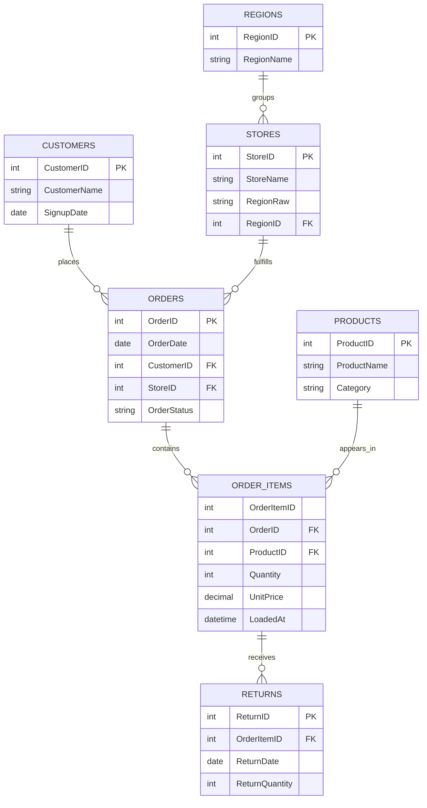

# Q3: Retail assessment ER diagram

```mermaid
erDiagram
    CUSTOMERS ||--o{ ORDERS : places
    STORES ||--o{ ORDERS : fulfills
    REGIONS ||--o{ STORES : groups
    ORDERS ||--o{ ORDER_ITEMS : contains
    PRODUCTS ||--o{ ORDER_ITEMS : appears_in
    ORDER_ITEMS ||--o{ RETURNS : receives

    CUSTOMERS {
        int CustomerID PK
        string CustomerName
        date SignupDate
    }
    REGIONS {
        int RegionID PK
        string RegionName
    }
    STORES {
        int StoreID PK
        string StoreName
        string RegionRaw
        int RegionID FK
    }
    PRODUCTS {
        int ProductID PK
        string ProductName
        string Category
    }
    ORDERS {
        int OrderID PK
        date OrderDate
        int CustomerID FK
        int StoreID FK
        string OrderStatus
    }
    ORDER_ITEMS {
        int OrderItemID
        int OrderID FK
        int ProductID FK
        int Quantity
        decimal UnitPrice
        datetime LoadedAt
    }
    RETURNS {
        int ReturnID PK
        int OrderItemID FK
        date ReturnDate
        int ReturnQuantity
    }
```

`OrderItems` is loaded with duplicate `OrderItemID` values so Q2 can keep the
latest record by `LoadedAt`. `OrderItemID` is the logical key after cleanup.
